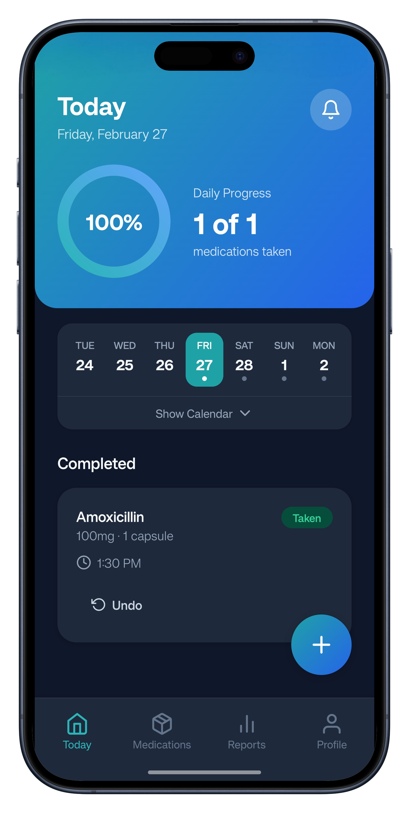
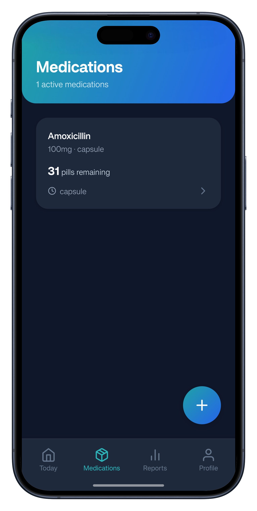
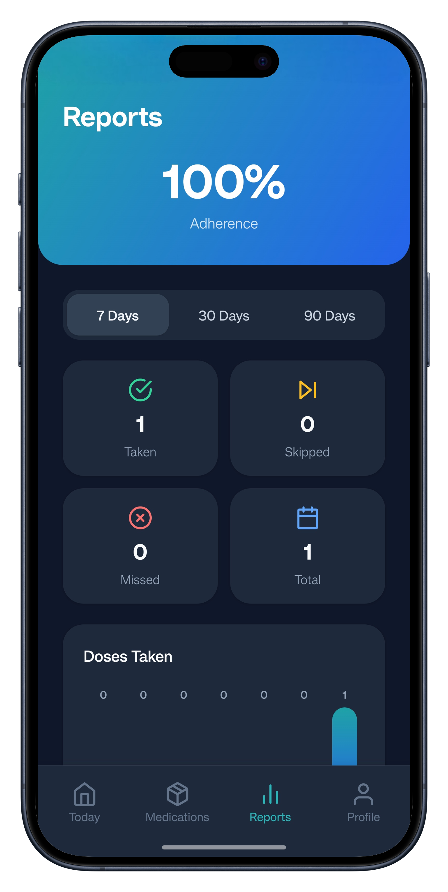
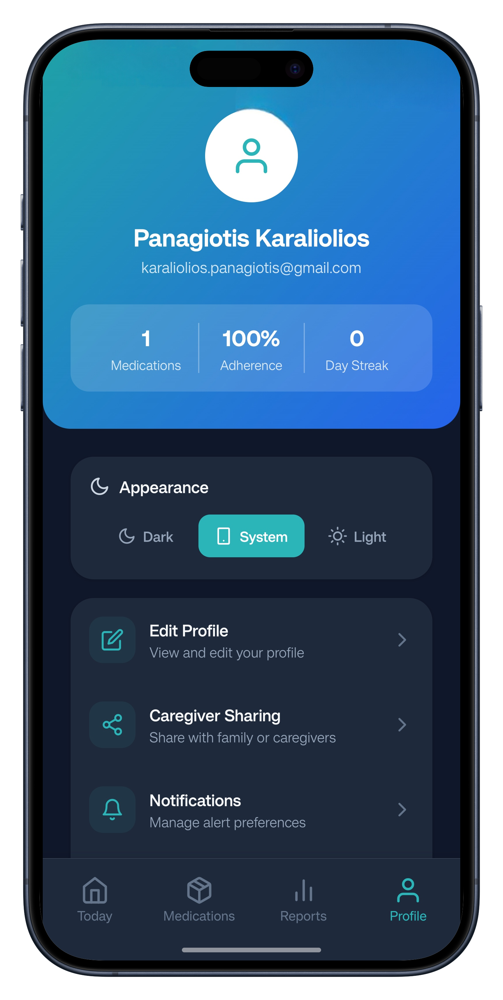

# 💊 MediTrack — Medication Tracker

A modern, full-featured medication tracking app built with **Expo** and **React Native**. Track medications, set smart reminders, monitor adherence, and stay on top of your health — all from your phone.

<p align="center">
  
  
  
  
  
</p>

---

## 📱 Screenshots

<p align="center">
  <picture>
    
  </picture>
  &nbsp;&nbsp;
  <picture>
    
  </picture>
  &nbsp;&nbsp;
  <picture>
    
  </picture>
  &nbsp;&nbsp;
  <picture>
    
  </picture>
</p>

<p align="center">
  <em>Today Dashboard &nbsp;·&nbsp; Medications &nbsp;·&nbsp; Reports &nbsp;·&nbsp; Profile</em>
</p>

---

## ✨ Features

### 📋 Medication Management
- Add, edit, and archive medications with name, dosage, form, and custom icons
- Track current supply with visual progress bars and low-supply alerts
- Support for all common medication forms (tablet, capsule, liquid, injection, etc.)

### ⏰ Smart Scheduling
- Flexible frequency options — daily, specific days, or custom patterns
- Multiple time slots per day (Morning, Afternoon, Evening, Night, or custom times)
- Start and end date support for limited-duration medications
- Configurable snooze durations per schedule

### 🔔 Push Notifications & Reminders
- Per-schedule push notification toggles
- Snooze actions directly from notifications (Take Now / Snooze Again)
- Low-supply reminders when inventory drops below threshold
- All reminders auto-restored on app launch

### ✅ Dose Tracking
- One-tap dose logging: mark as taken or skipped
- Undo capability for accidental logs
- Optimistic UI updates — instant feedback, background sync
- Calendar view showing daily adherence status (complete / partial / missed)

### 📊 Reports & Analytics
- Weekly and monthly adherence charts
- Streak tracking — consecutive days with full adherence
- Per-medication missed-dose breakdown
- Visual bar charts with color-coded adherence levels

### 👤 User Profile
- Secure authentication via Supabase (email/password)
- Profile management (name, age)
- At-a-glance stats: medication count, adherence rate, day streak
- Dark mode / light mode / system theme preference

### 🌙 Dark Mode
- Full dark mode support across every screen and component
- System theme auto-detection
- Manual toggle in profile settings

---

## 🏗️ Architecture

```
┌─────────────────────────────────────────────────────────┐
│                    Expo Router (Screens)                │
│  ┌──────────┐ ┌──────────┐ ┌──────────┐ ┌───────────┐   │
│  │  Today   │ │   Meds   │ │ Reports  │ │  Profile  │   │
│  └────┬─────┘ └─────┬────┘ └─────┬────┘ └───────┬───┘   │
│       │             │            │              │       │
│  ┌────▼─────────────▼────────────▼──────────────▼────┐  │
│  │              TanStack Query (Server State)        │  │
│  │     useMedications · useSchedules · useDoseLogs   │  │
│  └──────────────────────┬────────────────────────────┘  │
│                         │                               │
│  ┌──────────────────────▼────────────────────────────┐  │
│  │               Supabase (Postgres + RLS)           │  │
│  │     medications · schedules · dose_logs · profiles│  │
│  └───────────────────────────────────────────────────┘  │
│                                                         │
│  ┌──────────────┐  ┌──────────────┐  ┌───────────────┐  │
│  │ Zustand      │  │ AuthContext  │  │ ThemeContext  │  │
│  │ (Form Drafts)│  │ (Auth+User)  │  │ (Dark Mode)   │  │
│  └──────────────┘  └──────────────┘  └───────────────┘  │
└─────────────────────────────────────────────────────────┘
```

### Tech Stack

| Layer | Technology | Purpose |
|---|---|---|
| **Framework** | Expo SDK 55, React Native 0.83.2 | Cross-platform mobile |
| **Routing** | Expo Router 55 | File-based navigation |
| **Language** | TypeScript 5.9 (strict) | Type safety |
| **Server State** | TanStack Query v5 | Data fetching, caching, mutations |
| **Client State** | Zustand v5 | Form draft state for multi-step flows |
| **Auth & DB** | Supabase | Authentication, Postgres, Row-Level Security |
| **Notifications** | expo-notifications | Push reminders with snooze actions |
| **UI** | React Native + custom components | 20 shared UI components |
| **Theming** | Custom theme system | Light/dark mode with system detection |
| **Package Manager** | Bun | Fast installs and scripts |

### Project Structure

```
medication-tracker/
├── app/                      # Screens (Expo Router file-based routing)
│   ├── _layout.tsx           # Root layout — provider hierarchy
│   ├── index.tsx             # Welcome / landing screen
│   ├── (tabs)/               # Tab navigator
│   │   ├── index.tsx         # Today dashboard
│   │   ├── medications.tsx   # Medications list
│   │   ├── reports.tsx       # Reports & analytics
│   │   └── profile.tsx       # User profile
│   ├── auth/                 # Authentication screens
│   │   ├── login.tsx
│   │   ├── signup.tsx
│   │   └── profile-setup.tsx
│   ├── medication/           # Medication flows
│   │   ├── add.tsx           # Add new medication
│   │   ├── [id].tsx          # Medication detail
│   │   ├── edit.tsx          # Edit medication
│   │   ├── edit-schedule.tsx # Edit existing schedule
│   │   ├── select.tsx        # Select medication to schedule
│   │   ├── schedule.tsx      # Set schedule details
│   │   ├── reminders.tsx     # Configure reminders
│   │   ├── review.tsx        # Review before saving
│   │   └── success.tsx       # Confirmation screen
│   └── profile/
│       └── edit.tsx          # Edit user profile
├── components/ui/            # 20 shared UI components + theme
├── hooks/                    # Custom hooks (queries, theme, calendar, snooze)
├── lib/                      # Supabase client, query client, notifications
├── stores/                   # Zustand stores (medication & schedule drafts)
├── types/                    # TypeScript types (database Row/Draft/Update)
├── constants/                # App constants (days, icons, medications, etc.)
└── utils/                    # Pure utility functions (date, dose, reports, etc.)
```

---

## 🗄️ Database Schema

Four tables with Row-Level Security (RLS) — every query is scoped to the authenticated user:

```sql
── medications ─────────────────────────────────────────
 id              UUID  PK
 user_id         UUID  FK → auth.users
 name            TEXT
 dosage          TEXT
 form            TEXT        -- tablet, capsule, liquid, etc.
 icon            TEXT
 current_supply  INTEGER
 low_supply_threshold INTEGER
 is_active       BOOLEAN     -- soft delete
 created_at      TIMESTAMPTZ
 updated_at      TIMESTAMPTZ

── schedules ───────────────────────────────────────────
 id              UUID  PK
 medication_id   UUID  FK → medications
 user_id         UUID  FK → auth.users
 frequency       TEXT        -- Daily, Specific Days, etc.
 selected_days   TEXT[]      -- ['Mon', 'Wed', 'Fri']
 times_of_day    TEXT[]      -- ['Morning', 'Evening']
 dosage_per_dose INTEGER
 push_notifications BOOLEAN
 sms_alerts      BOOLEAN
 snooze_duration TEXT        -- '5 min', '15 min', etc.
 instructions    TEXT
 start_date      DATE
 end_date        DATE        -- NULL = continue forever
 is_active       BOOLEAN     -- soft delete
 created_at      TIMESTAMPTZ
 updated_at      TIMESTAMPTZ

── dose_logs ───────────────────────────────────────────
 id              UUID  PK
 schedule_id     UUID  FK → schedules
 medication_id   UUID  FK → medications
 user_id         UUID  FK → auth.users
 scheduled_date  DATE
 time_label      TEXT        -- 'Morning', '08:30', etc.
 status          TEXT        -- 'taken' | 'skipped'
 logged_at       TIMESTAMPTZ
 created_at      TIMESTAMPTZ
 UNIQUE (schedule_id, scheduled_date, time_label)

── profiles ────────────────────────────────────────────
 id              UUID  PK  = auth.uid()
 full_name       TEXT
 age             INTEGER
```

---

## 🚀 Getting Started

### Prerequisites

- [Node.js](https://nodejs.org/) 18+ (for Expo CLI)
- [Bun](https://bun.sh/) (package manager)
- [Expo CLI](https://docs.expo.dev/get-started/installation/)
- [Expo Go](https://expo.dev/go) app on your device **or** a [development build](https://docs.expo.dev/develop/development-builds/introduction/)
- A [Supabase](https://supabase.com/) project (free tier works)

### 1. Clone the repository

```bash
git clone https://github.com/PanagiotisKaraliolios/medication-tracker.git
cd medication-tracker
```

### 2. Install dependencies

```bash
bun install
```

### 3. Configure environment variables

Create a `.env` file in the project root:

```env
EXPO_PUBLIC_SUPABASE_URL=https://your-project.supabase.co
EXPO_PUBLIC_SUPABASE_KEY=your-anon-public-key
```

> Get these from your Supabase project dashboard → Settings → API.

### 4. Set up the database

Run the SQL from the [Database Schema](#️-database-schema) section in the Supabase SQL Editor to create the tables. Enable **Row-Level Security (RLS)** on all four tables with policies that filter by `user_id = auth.uid()`.

### 5. Start the development server

```bash
bun run start
```

Scan the QR code with Expo Go, or press:
- `a` — open on Android emulator
- `i` — open on iOS simulator
- `w` — open in web browser

### Building for device

For push notifications and full native functionality, create a development build:

```bash
bun run prebuild
bun run android   # or: bun run ios
```

---

## 📁 Key Files Reference

| File | Purpose |
|---|---|
| `hooks/useQueryHooks.ts` | All TanStack Query/mutation hooks (548 lines) |
| `stores/draftStores.ts` | Zustand stores for medication & schedule drafts |
| `lib/queryClient.ts` | Query client singleton (staleTime, gcTime, focus) |
| `lib/queryKeys.ts` | Centralised query key factory for cache invalidation |
| `lib/notifications.ts` | Push notification scheduling, snooze actions, low-supply alerts |
| `lib/supabase.ts` | Supabase client singleton |
| `types/database.ts` | All TypeScript types (Row, Draft, Update) + empty defaults |
| `contexts/AuthContext.tsx` | Auth state, session management, profile loading |
| `contexts/ThemeContext.tsx` | Theme preference with AsyncStorage persistence |
| `components/ui/theme.ts` | Color schemes, gradients, shadows, border radii |

---

## 🧩 State Management

| Concern | Solution | Location |
|---|---|---|
| **Server data** (medications, schedules, dose logs) | TanStack Query v5 | `hooks/useQueryHooks.ts` |
| **Form drafts** (multi-step creation flows) | Zustand v5 | `stores/draftStores.ts` |
| **Authentication** (session, user, profile) | React Context | `contexts/AuthContext.tsx` |
| **Theme** (light / dark / system) | React Context | `contexts/ThemeContext.tsx` |

> There is no `MedicationContext` or Redux. Screens consume data exclusively through TanStack Query hooks and never call `supabase.from()` directly for medications, schedules, or dose logs.

---

## 🎨 Theming

Every component supports light and dark mode:

```tsx
const c = useThemeColors();                        // Get current color scheme
const styles = useMemo(() => makeStyles(c), [c]);  // Memoize styles

// At bottom of file:
function makeStyles(c: ColorScheme) {
  return StyleSheet.create({
    container: { flex: 1, backgroundColor: c.background },
    card: { backgroundColor: c.card, ...shadows.sm, borderRadius: borderRadius.lg },
  });
}
```

---

## 📜 Scripts

| Command | Description |
|---|---|
| `bun run start` | Start Expo dev server |
| `bun run start:tunnel` | Start with tunnel (for physical devices on different networks) |
| `bun run prebuild` | Generate native projects (clean) |
| `bun run android` | Prebuild + run on Android |
| `bun run ios` | Prebuild + run on iOS |
| `bun run web` | Start for web |

---

## 🛠️ Built With

- [Expo](https://expo.dev/) — Universal React framework
- [React Native](https://reactnative.dev/) — Cross-platform mobile UI
- [Expo Router](https://docs.expo.dev/router/introduction/) — File-based routing
- [Supabase](https://supabase.com/) — Auth, Postgres, Row-Level Security
- [TanStack Query](https://tanstack.com/query) — Server state management
- [Zustand](https://zustand-demo.pmnd.rs/) — Lightweight client state
- [expo-notifications](https://docs.expo.dev/versions/latest/sdk/notifications/) — Push notifications
- [expo-linear-gradient](https://docs.expo.dev/versions/latest/sdk/linear-gradient/) — Gradient UI elements
- [react-native-toast-message](https://github.com/calintamas/react-native-toast-message) — Toast notifications

---

## 📄 License

This project is private and not licensed for public use.

---

<p align="center">
  Made with ❤️ using Expo & React Native
</p>
