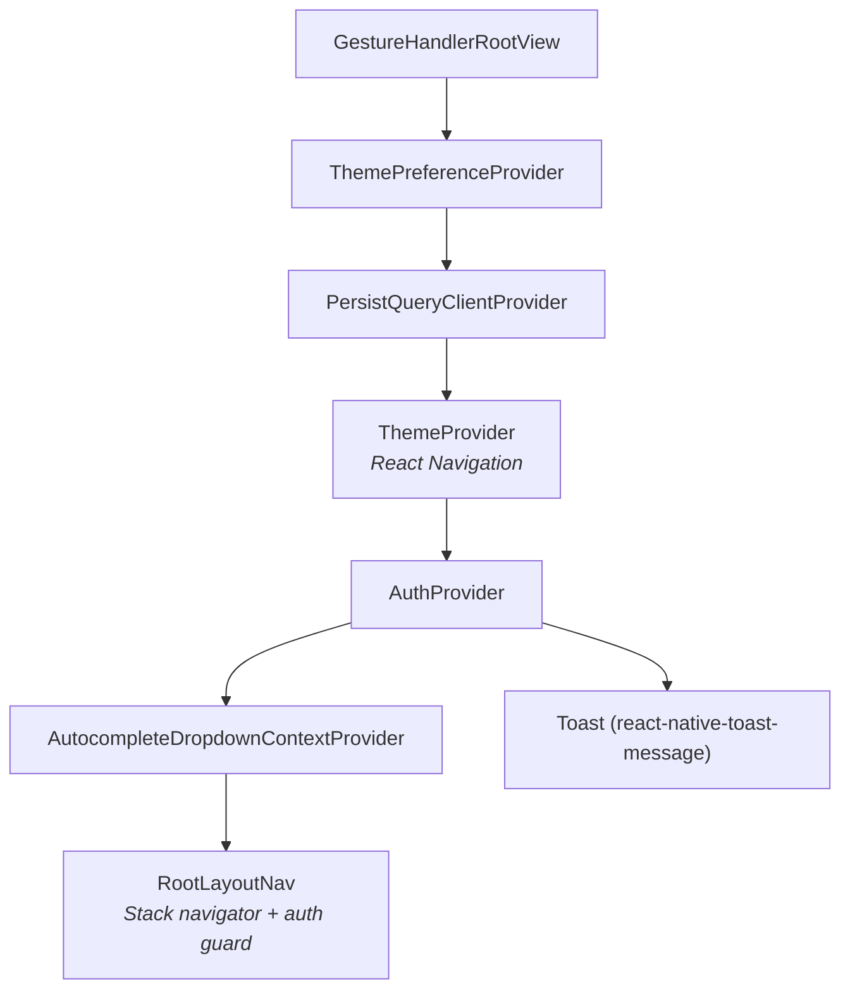
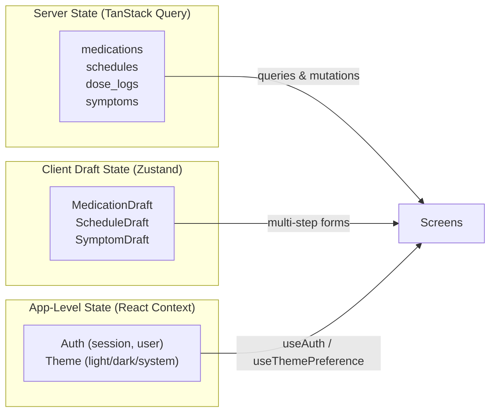
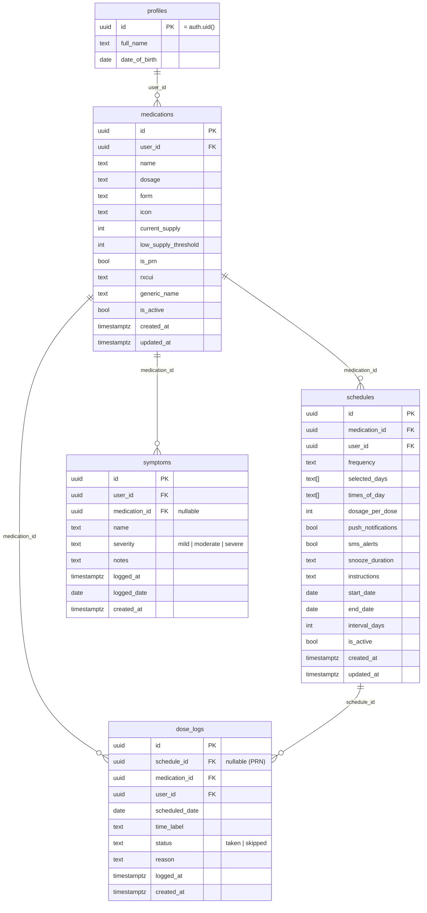
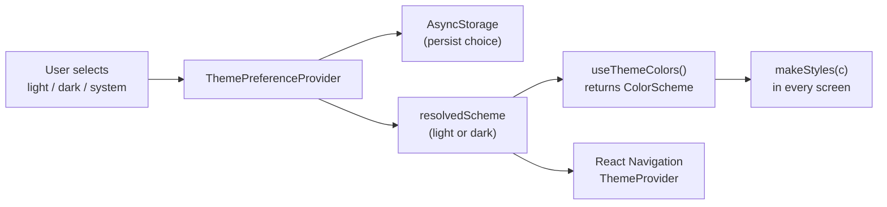

# MediTrack — Architecture Documentation

> A comprehensive medication tracking app built with Expo, React Native, and Supabase.

---

## 1. High-Level Architecture Overview

MediTrack follows a **client-heavy** architecture: a React Native mobile app handles all UI, local state, and business logic, communicating with a Supabase backend for authentication, persistent storage, and row-level security.

```
┌─────────────────────────────────────────────────────────┐
│                    React Native App                     │
│  ┌────────────┐  ┌───────────────┐  ┌───────────────┐  │
│  │ Expo Router│  │ TanStack Query│  │   Zustand     │  │
│  │ (nav)      │  │ (server state)│  │ (draft state) │  │
│  └─────┬──────┘  └───────┬───────┘  └───────────────┘  │
│        │                 │                              │
│  ┌─────┴─────────────────┴───────────────────────────┐  │
│  │              Supabase JS Client                   │  │
│  └───────────────────────┬───────────────────────────┘  │
│                          │                              │
│  ┌───────────────────────┴───────────────────────────┐  │
│  │  expo-notifications  │  AsyncStorage  │  Widgets  │  │
│  └───────────────────────────────────────────────────┘  │
└──────────────────────────┬──────────────────────────────┘
                           │ HTTPS
┌──────────────────────────┴──────────────────────────────┐
│                  Supabase Backend                       │
│  ┌──────────┐  ┌──────────────┐  ┌───────────────────┐ │
│  │  Auth     │  │  PostgreSQL  │  │   Row-Level       │ │
│  │  (GoTrue) │  │  (5 tables)  │  │   Security (RLS)  │ │
│  └──────────┘  └──────────────┘  └───────────────────┘ │
└─────────────────────────────────────────────────────────┘
```

### Provider Hierarchy

The root layout wraps the app in a strict provider order. Every provider is accessible from any screen below it.



**Why this order matters:**
- `ThemePreferenceProvider` must wrap `QueryClientProvider` so theme changes don't remount the query cache.
- `AuthProvider` sits inside `QueryClientProvider` so mutations/queries can be triggered during auth flows.
- `Toast` is a sibling of `RootLayoutNav` (not a child) so it renders above all screens.

---

## 2. Technology Stack

| Layer | Technology | Version | Purpose |
|---|---|---|---|
| **Runtime** | Expo SDK | 55.0.8 | Managed native workflow |
| **UI** | React | 19.2.0 | UI library |
| **UI** | React Native | 0.83.2 | Cross-platform rendering |
| **Navigation** | Expo Router | 55.0.7 | File-based routing |
| **Server State** | TanStack Query | 5.94.5 | Caching, fetching, mutations |
| **Client State** | Zustand | 5.x | Form draft stores |
| **Auth & DB** | Supabase JS | 2.99.3 | Auth, Postgres, RLS |
| **Notifications** | expo-notifications | 55.0.13 | Push/local notifications |
| **Ads** | react-native-google-mobile-ads | 16.3.0 | Banner, interstitial, app-open ads |
| **Language** | TypeScript | 5.9.3 | Strict mode |
| **Package Manager** | Bun | — | Install & run scripts |
| **Persistence** | AsyncStorage | 2.2.0 | Theme prefs, query cache, session |

---

## 3. Directory Structure

```
app/                          # Screens — Expo Router file-based routing
├── _layout.tsx               # Root layout (providers, auth guard, reminder sync)
├── index.tsx                 # Welcome / landing screen
├── (tabs)/                   # Bottom tab navigator
│   ├── _layout.tsx           # Tab bar config (animated icons, tablet side rail)
│   ├── index.tsx             # Today tab (dose cards, calendar strip)
│   ├── medications.tsx       # Medications list (master-detail on tablet)
│   ├── reports.tsx           # Adherence reports (7/30/90 days)
│   └── profile.tsx           # Profile & settings
├── auth/                     # Auth flow screens
│   ├── login.tsx
│   ├── signup.tsx
│   └── profile-setup.tsx
├── medication/               # Medication CRUD & scheduling
│   ├── add.tsx               # Add medication (single-step)
│   ├── [id].tsx              # Medication detail (dynamic route)
│   ├── edit.tsx              # Edit medication fields
│   ├── edit-schedule.tsx     # Edit existing schedule
│   ├── select.tsx            # Select med for new schedule
│   ├── schedule.tsx          # Configure schedule
│   ├── reminders.tsx         # Notification preferences
│   ├── review.tsx            # Review before saving
│   ├── success.tsx           # Success confirmation
│   └── log-prn.tsx           # Log PRN (as-needed) dose
└── profile/
    └── edit.tsx              # Edit profile (name, DOB)

lib/                          # Singletons & SDK configuration
├── supabase.ts               # Supabase client (AsyncStorage session)
├── queryClient.ts            # QueryClient + AsyncStorage persister
├── queryKeys.ts              # Centralised query key factory
├── notifications.ts          # Push notification registration & scheduling
├── ads.ts                    # AdMob initialization
├── interstitialManager.ts    # Interstitial ad preloading
├── drugApi.ts                # RxNorm & OpenFDA API clients
└── widgetBridge.tsx          # Native widget data bridge

hooks/                        # Custom React hooks
├── useQueryHooks.ts          # ALL TanStack Query/mutation hooks (~600 lines)
├── useThemeColors.ts         # Returns active ColorScheme
├── useCalendar.ts            # Calendar date navigation state
├── useSnooze.ts              # Snooze timer management
├── useResponsive.ts          # Tablet detection & layout helpers
├── useDrugSearch.ts          # Drug autocomplete search
├── useGoogleAuth.ts          # Google OAuth flow
├── useNetworkStatus.ts       # Online/offline detection
├── useBatteryOptimization.ts # Android battery prompt
└── useAppOpenAd.ts           # App-open ad on foreground return

stores/                       # Zustand stores (client-only draft state)
├── draftStores.ts            # MedicationDraft, ScheduleDraft, SymptomDraft
└── adPreferencesStore.ts     # Per-placement ad toggles

contexts/                     # React Context (auth & theme only)
├── AuthContext.tsx            # Session, user, profile, signOut
└── ThemeContext.tsx           # Theme preference + resolved scheme

types/                        # TypeScript type definitions
├── database.ts               # Row, Draft, Update types + empty defaults
└── drug.ts                   # Drug search API response types

components/ui/                # 20+ shared UI components
├── theme.ts                  # Color tokens, spacing, typography, gradients
├── Button.tsx, Input.tsx     # Form primitives
├── AlertDialog.tsx           # Modal dialog (destructive/info/warning/success)
├── MedicationCard.tsx        # Dose card (pending/taken/skipped)
├── LoadingState.tsx          # Spinner placeholder
├── ErrorState.tsx            # Error with retry
├── EmptyState.tsx            # Empty data placeholder
└── ...                       # CalendarSection, ProgressRing, etc.

constants/                    # Static configuration (barrel-exported)
utils/                        # Pure utility functions (barrel-exported)
```

---

## 4. State Management Architecture

MediTrack uses a **three-tier** state model. Each tier has a clear boundary.



### 4.1 TanStack Query — Server State

All Supabase CRUD for `medications`, `schedules`, `dose_logs`, and `symptoms` is encapsulated in hooks in `hooks/useQueryHooks.ts`. **Screens never call `supabase.from()` directly** for these tables.

**QueryClient configuration** (`lib/queryClient.ts`):

| Setting | Value | Purpose |
|---|---|---|
| `staleTime` | 2 min | Data considered fresh — prevents unnecessary refetches |
| `gcTime` | 24 hours | Survives app restarts via AsyncStorage persister |
| `retry` (queries) | 2 | Auto-retry failed fetches |
| `retry` (mutations) | 1 | Single retry on mutation failure |
| `networkMode` (mutations) | `offlineFirst` | Queue mutations when offline |
| `refetchOnWindowFocus` | `true` | Refetch when app returns to foreground |

**Query persistence:** The query cache is persisted to AsyncStorage via `@tanstack/query-async-storage-persister`, wrapped in `PersistQueryClientProvider`. This enables instant UI on cold starts.

**Query key factory** (`lib/queryKeys.ts`):

```typescript
queryKeys.medications.all           // ['medications']
queryKeys.medications.detail(id)    // ['medications', id]
queryKeys.schedules.all             // ['schedules']
queryKeys.schedules.byMedication(id)// ['schedules', 'byMedication', id]
queryKeys.doseLogs.byDate(date)     // ['doseLogs', 'byDate', date]
queryKeys.doseLogs.byRange(s, e)    // ['doseLogs', 'byRange', s, e]
queryKeys.symptoms.all              // ['symptoms']
queryKeys.profile.current           // ['profile']
```

**Query hooks:**

| Hook | Returns | Notes |
|---|---|---|
| `useMedications()` | `MedicationRow[]` | All active meds, ordered by `created_at` desc |
| `useMedication(id)` | `MedicationRow` | Single medication |
| `useSchedules()` | `ScheduleRow[]` | All active schedules |
| `useSchedulesByMedication(medId)` | `ScheduleRow[]` | Schedules for one med |
| `useDoseLogsByDate(date)` | `DoseLogRow[]` | Logs for a single day |
| `useDoseLogsByRange(start, end)` | `DoseLogRow[]` | Logs for a date range |

**Mutation hooks** — All mutations invalidate relevant caches in `onSuccess`:

| Hook | Action | Cache Invalidation |
|---|---|---|
| `useCreateMedication()` | Insert medication | `medications.all` |
| `useUpdateMedication()` | Update medication | `medications.all`, `medications.detail` |
| `useDeleteMedication()` | Soft-delete medication | `medications.all`, `schedules.all` |
| `useAdjustSupply()` | Increment/decrement supply | `medications.all`, `medications.detail` |
| `useCreateSchedule()` | Insert schedule | `schedules.all`, `schedules.byMedication` |
| `useUpdateSchedule()` | Update schedule | `schedules.all`, `schedules.byMedication`, `schedules.detail` |
| `useLogDose()` | Upsert dose log | `doseLogs.*` (all keys) |

### 4.2 Zustand — Client Draft State

Multi-step creation flows use Zustand stores in `stores/draftStores.ts`. Three stores exist:

| Store | Fields | Used By |
|---|---|---|
| `useMedicationDraft` | `draft`, `updateDraft`, `resetDraft` | `medication/add.tsx` |
| `useScheduleDraft` | `scheduleDraft`, `schedulingMedId`, `updateScheduleDraft`, `resetScheduleDraft` | `medication/schedule.tsx` → `review.tsx` flow |
| `useSymptomDraft` | `symptomDraft`, `updateSymptomDraft`, `resetSymptomDraft` | `log-symptom.tsx` |

**Draft vs Row:** Drafts use `camelCase` (form-friendly). Rows use `snake_case` (DB-native). Manual mapping is required at the mutation boundary:

```
Draft field          →  DB column
draft.currentSupply  →  current_supply
draft.dosagePerDose  →  dosage_per_dose
```

**When editing** an existing entity, screens use local `useState` populated from query data — **not** the shared draft stores.

### 4.3 React Context — Auth & Theme

Only two contexts exist (no `MedicationProvider`):

- **`AuthContext`** — Supabase auth listener, session/user state, profile check, `signOut()`. Access via `useAuth()`.
- **`ThemeContext`** — Theme preference (`light | dark | system`) with AsyncStorage persistence. Access via `useThemePreference()`.

---

## 5. Database Schema

Five tables in Supabase PostgreSQL, all with **Row-Level Security** (RLS) scoped to `auth.uid()`.



### RLS Policies

Every table enforces `user_id = auth.uid()` on all operations (SELECT, INSERT, UPDATE, DELETE). The app also includes `.eq('user_id', user.id)` in queries as a defense-in-depth measure.

### Soft Deletes

`medications` and `schedules` use an `is_active` boolean — queries always filter `.eq('is_active', true)`. `dose_logs` and `profiles` use hard deletes.

### Unique Constraints

`dose_logs` has a unique constraint on `(schedule_id, scheduled_date, time_label)`, enabling upsert-based idempotent dose logging.

---

## 6. Navigation Structure

Expo Router provides file-based routing. The navigation tree:

```mermaid
graph TD
    Root["RootLayout<br/><i>Stack</i>"] --> Welcome["index.tsx<br/><i>Welcome screen</i>"]
    Root --> Auth["auth/"]
    Auth --> Login["login.tsx"]
    Auth --> Signup["signup.tsx"]
    Auth --> ProfileSetup["profile-setup.tsx"]

    Root --> Tabs["(tabs)/<br/><i>Bottom Tab Navigator</i>"]
    Tabs --> Today["index.tsx<br/><i>Today</i> 🏠"]
    Tabs --> Meds["medications.tsx<br/><i>Medications</i> 📦"]
    Tabs --> Reports["reports.tsx<br/><i>Reports</i> 📊"]
    Tabs --> Profile["profile.tsx<br/><i>Profile</i> 👤"]

    Root --> MedFlow["medication/"]
    MedFlow --> Add["add.tsx<br/><i>modal</i>"]
    MedFlow --> Detail["[id].tsx"]
    MedFlow --> Edit["edit.tsx"]
    MedFlow --> EditSched["edit-schedule.tsx"]
    MedFlow --> Select["select.tsx"]
    MedFlow --> Schedule["schedule.tsx"]
    MedFlow --> Reminders["reminders.tsx"]
    MedFlow --> Review["review.tsx"]
    MedFlow --> Success["success.tsx"]
    MedFlow --> LogPRN["log-prn.tsx"]

    Root --> Settings["Settings screens"]
    Settings --> NotifSettings["notification-settings.tsx"]
    Settings --> Privacy["privacy-security.tsx"]
    Settings --> ChangePass["change-password.tsx"]
    Settings --> AdPrefs["ad-preferences.tsx"]
    Settings --> LogSymptom["log-symptom.tsx"]
    Settings --> Symptoms["symptoms.tsx"]
```



### Auth Guard

Handled in `app/_layout.tsx` via a `useEffect` that watches `session`, `loading`, and `hasProfile`:

| Condition | Redirect |
|---|---|
| No session + not on public auth screen | → `/` (Welcome) |
| Session + no profile | → `/auth/profile-setup` |
| Session + profile + on auth/welcome screen | → `/(tabs)` |

### Tab Bar

Four tabs with animated `Feather` icons: **Today** (home), **Medications** (package), **Reports** (bar-chart-2), **Profile** (user). On tablets, the tab bar renders as a **side rail** instead of a bottom bar.

---

## 7. Data Flow — Logging a Dose (End-to-End)

This diagram traces what happens when a user taps "Take" on a dose card in the Today tab.

```mermaid
sequenceDiagram
    participant U as User
    participant S as Today Screen
    participant OPT as Optimistic Update
    participant TQ as TanStack Query
    participant SB as Supabase
    participant N as Notifications
    participant W as Widget

    U->>S: Tap "Take" on dose card
    S->>OPT: Snapshot current query data
    OPT->>S: Update UI immediately (card → "taken")

    S->>TQ: logDose.mutateAsync({ scheduleId, medicationId, date, timeLabel, status: 'taken' })
    TQ->>SB: UPSERT into dose_logs (onConflict: schedule_id, scheduled_date, time_label)
    SB-->>TQ: Return DoseLogRow

    TQ->>TQ: Invalidate doseLogs.byDate, doseLogs.byRange

    S->>TQ: adjustSupply.mutateAsync({ id: medId, delta: -dosagePerDose })
    TQ->>SB: UPDATE medications SET current_supply = current_supply - N
    SB-->>TQ: Return updated MedicationRow

    TQ->>TQ: Invalidate medications.all, medications.detail

    S->>N: Cancel scheduled notification for this time slot
    S->>W: Update home screen widget with new next dose

    Note over OPT,S: On mutation failure → revert to snapshot + show error Toast
```

### Derived Data Pattern

The Today screen computes what to display using `useMemo` over three query results:

```
medications (query) ─┐
schedules (query)  ──┤──▶ buildTodayDoses() ──▶ todayDoses[]
doseLogs (query)   ──┘
```

No extra state is needed — `todayDoses` recomputes whenever any dependency changes.

---

## 8. Theming System

MediTrack supports **light**, **dark**, and **system** themes.

### Color Tokens

Defined in `components/ui/theme.ts` as two const objects: `colors` (light) and `darkColors` (dark). Both share the same `ColorScheme` type so they're interchangeable.

| Token | Light | Dark | Semantic Use |
|---|---|---|---|
| `background` | `#F6F9FC` | `#0F172A` | Page background |
| `card` | `#FFFFFF` | `#1E293B` | Card/surface |
| `gray900` | `#111827` | `#F9FAFB` | Primary text |
| `gray500` | `#6B7280` | `#94A3B8` | Secondary text |
| `teal` | `#1FA2A6` | `#2BB5B9` | Primary brand |
| `success` | `#10B981` | `#34D399` | Positive actions |
| `error` | `#EF4444` | `#F87171` | Destructive actions |

### Design Tokens

```typescript
gradients.primary     // ['#1FA2A6', '#2563EB'] — hero headers
borderRadius.lg       // 16 — standard card radius
shadows.sm / .md      // Elevation presets
spacing.lg            // 16 — standard padding
```

### Usage Pattern (Every Screen)

```typescript
import { type ColorScheme, borderRadius, shadows } from '../../components/ui/theme';
import { useThemeColors } from '../../hooks/useThemeColors';

export default function MyScreen() {
  const c = useThemeColors();                        // 1. Get colors
  const styles = useMemo(() => makeStyles(c), [c]);  // 2. Memoize
  return <View style={styles.container}>...</View>;
}

function makeStyles(c: ColorScheme) {                // 3. Bottom of file
  return StyleSheet.create({
    container: { flex: 1, backgroundColor: c.background },
    card: { backgroundColor: c.card, ...shadows.sm, borderRadius: borderRadius.lg },
    title: { color: c.gray900 },
  });
}
```

**Conventions:**
- Theme variable is always named `c`.
- `c.card` for surfaces — never hardcode `#FFFFFF`.
- `c.white` only for text on gradient backgrounds.
- `makeStyles(c)` is always the **last** function in the file.

### Theme Flow



---

## Appendix: Key External APIs

| API | Purpose | Module |
|---|---|---|
| **NLM RxNorm** | Drug name autocomplete + RxCUI lookup | `lib/drugApi.ts` |
| **OpenFDA Drug Labeling** | Drug-drug interaction checks | `lib/drugApi.ts` |
| **Google AdMob** | Banner, interstitial, app-open ads | `lib/ads.ts`, `lib/interstitialManager.ts` |
| **Expo Notifications** | Local push notifications + snooze actions | `lib/notifications.ts` |
