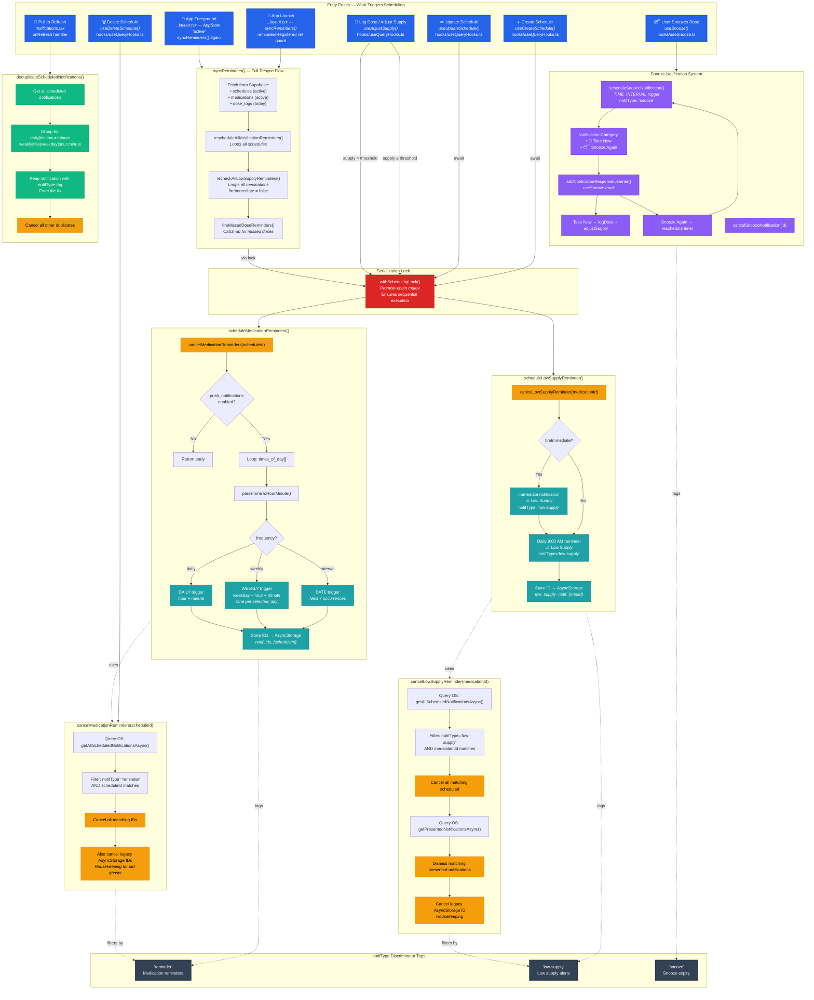

# MediTrack Notification System — Architecture

## Overview

The notification system manages three types of local notifications via `expo-notifications`:

| Type | Tag (`notifType`) | Purpose | Trigger |
|---|---|---|---|
| Medication Reminders | `reminder` | Remind user to take a dose | DAILY / WEEKLY / DATE |
| Low Supply Alerts | `low-supply` | Warn about low inventory | Immediate + Daily 9 AM |
| Snooze Expiry | `snooze` | Alert when snooze timer ends | TIME_INTERVAL |

## Architecture Diagram

## Key Files

| File | Role |
|---|---|
| `lib/notifications.ts` | Core scheduling, cancellation, deduplication, and permission logic |
| `app/_layout.tsx` | `syncReminders()` — full resync on launch and every foreground |
| `hooks/useQueryHooks.ts` | Mutation hooks that trigger scheduling (create/update schedule, adjust supply) |
| `hooks/useSnooze.ts` | Snooze timer management and notification action handling |
| `app/notifications.tsx` | Notification listing screen with pull-to-refresh deduplication |
| `utils/notificationHelpers.ts` | Display helpers — trigger descriptions, icons, grouping |
| `constants/storage.ts` | AsyncStorage key constants |

## Concurrency Safety

All scheduling and cancellation operations are serialized through `withSchedulingLock()` — a promise-chain mutex in `lib/notifications.ts`. This prevents race conditions between:

- Mutation hooks (e.g. `useCreateSchedule`) and foreground sync (`syncReminders`)
- Multiple rapid foreground/background cycles
- Concurrent supply adjustments

## Cancellation Strategy

Cancellation queries the **OS-level scheduled notifications** (`getAllScheduledNotificationsAsync()`) and filters by `notifType` + entity ID, rather than relying solely on AsyncStorage-stored notification IDs. This eliminates "ghost" notifications whose IDs were lost in race conditions. Legacy AsyncStorage entries are still cleaned up as housekeeping.

## Deduplication (Legacy Cleanup)

`deduplicateScheduledNotifications()` runs on pull-to-refresh in the Notifications screen. It groups notifications by trigger signature (`type|title|time`) and cancels duplicates, preferring the one tagged with `notifType`. This cleans up ghost notifications created before the fix was deployed.
